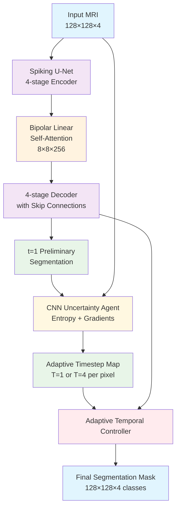

# Adaptive Timestep SNN Architecture Diagram
# This file contains the Mermaid diagram markup for the architecture
# To render: Use any Mermaid-compatible viewer or online editor

```mermaid
graph TD
    A[Input MRI<br/>128×128×4] --> B[Spiking U-Net<br/>4-stage Encoder]
    B --> C[Bipolar Linear<br/>Self-Attention<br/>8×8×256]
    C --> D[4-stage Decoder<br/>with Skip Connections]
    D --> E[t=1 Preliminary<br/>Segmentation]

    E --> F[CNN Uncertainty Agent<br/>Entropy + Gradients]
    A --> F

    F --> G[Adaptive Timestep Map<br/>T=1 or T=4 per pixel]

    G --> H[Adaptive Temporal Controller]
    D --> H

    H --> I[Final Segmentation Mask<br/>128×128×4 classes]

    style A fill:#e1f5fe
    style B fill:#f3e5f5
    style C fill:#fff3e0
    style D fill:#f3e5f5
    style E fill:#e8f5e8
    style F fill:#fff8e1
    style G fill:#e8f5e8
    style H fill:#ffebee
    style I fill:#e1f5fe
```